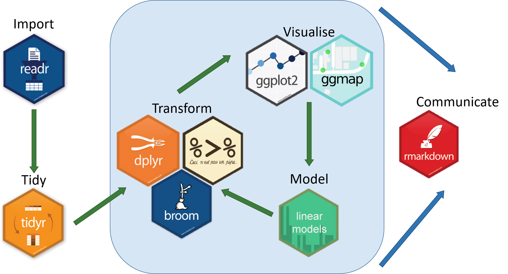

```{r setup, include = FALSE, message = FALSE, warning= FALSE}
knitr::opts_chunk$set(echo = TRUE)
library(here)
library(tidyverse)
library(kableExtra)
library(icon)

```

#Welcome to the tidyverse special edition workshop!

.center[]


---
#The workshop plan

- Intro 

- Importing and wrangling

- Summarizing data

- Reporting

---
# First, what is tidyverse??

.center[]

---

#R base vs. tidyverse

Base R:

`starwars[starwars$height <200 & starwars$gender == "male",]`

Tidyverse:

`starwars %>% 
  filter(height <200,
         gender == "male")`

Base R:

`starwars_dt[, c("height_m") := .(height/100)]`

`starwars_dt[, c("bmi") := .(mass/height_m^2)]`

Tidyverse:

`starwars %>% 
mutate(height_m = height/100,
       bmi = mass/height_m^2)`
       
---

#About tidyverse

.pull-left[
As a set of principles:

- Human-centered

- Consistent

- Composable

- Inclusive

.footnote[https://principles.tidyverse.org/]
]


.pull-right[
As a set of packages:

- Domain oriented

- Language-like interface

- Data is the important scope
]


---

background-image: url("https://gph.to/2P76mN8")
background-position: 50% 50%

# Hands on!

`library(tidyverse)`
---
#About the data

We will be using **Game of thrones** data, obtained from two different sources.

- `got_char` has data the total of minutes and seconds per season for each character.
(link: [https://github.com/Preetish/GoT_screen_time](https://github.com/Preetish/GoT_screen_time)).

- `got_houses` has data on the House each character belongs to, and the gender. (link: [https://github.com/benkahle/bayesianGameofThrones](https://github.com/benkahle/bayesianGameofThrones)).


Don't worry, we are not including data on who died **#nospoilers**

---
###1. Importing: **readr** package

Importing `got_char`

```{r message = FALSE}
got_char <- read_csv("./got_char.csv")
head(got_char,3)
dim(got_char)

```

---

Importing `got_houses`

```{r}
got_houses <- read_csv("./got_houses.csv")
head(got_houses, 3)
dim(got_houses)
```

---

###2. Merging the two datasets

1. Pick identifier/key variables on each dataset.
2. Choose how you want to merge: [Animated joins by @gadenbuie](https://github.com/gadenbuie/tidyexplain)

.pull-left[
- left_join
- right_join
- inner_join]
.pull-right[
- full_join
- anti_join
- semi-join]

```{r}
got_complete <- got_char %>% 
  left_join(got_houses, by = c("actor" = "name"))

head(got_complete, 3)
```

---
### 1. Building the Top 10

```{r echo=FALSE}
got_complete %>%
  mutate(total = (season_1 + season_2 + season_3 + season_4 + season_5 + season_6 + season_7 ),
         rank = case_when(total >= 200 ~ "Main cast",
                          total <200 & total >= 50 ~ "Supporting cast",
                          total <50 ~ "Extra"),
         house_a = ifelse(is.na(house_a), "Other", house_a)) %>% 
  arrange(desc(total)) %>% 
  select(actor, total, house_a) %>% 
  slice(1:10) %>% 
  rename(Character = actor,
         House = house_a,
         `Total acting time` = total) %>% 
  kable() %>% 
  kable_styling(bootstrap_options = c("hover", "condensed", "responsive"),
                full_width = F, font_size = 16) %>% 
  row_spec(0, bold = T, color = " white", background = "#562457") %>% 
  column_spec(1, bold = T, color = " white", 
              border_right = T, background = "#88398A") %>%
  add_header_above(c("TOP 10 Characters" = 3))
  
```
---
###**Mutate** function

```{r}
got_complete_rank  <- got_complete %>%
  mutate(total = season_1 + season_2 + season_3 +
           season_4 + season_5 + season_6 + season_7 )
```

---
### Conditional terms using **Mutate**

mutate/case_when
```{r}
got_complete_rank <- got_complete_rank %>% 
  mutate(rank = case_when(
    total >= 200 ~ "Main cast",
    total <200 & total >= 50 ~ "Supporting cast",
    total <50 ~ "Extra"))
```

mutate/ifelse
```{r}
got_complete_rank  <- got_complete_rank %>%
  mutate(house_a = ifelse(is.na(house_a), "Other", house_a))
```

---
### **Arrange** function

Ascending
```{r}
got_complete_rank <- got_complete_rank %>% 
  arrange(total)
```


Descending

```{r}
got_complete_rank <- got_complete_rank %>% 
  arrange(desc(total))
```

---
### **Select** function

```{r}
top_ten<- got_complete_rank%>%
  select(actor, total, house_a) 

head(top_ten)

```
Helpfull feats of `select`
- starts_with("season")
- ends_with("")
- contains("hous")
- matches(<regex>)
- -house_b
- -c(house_a, gender)
- everything()

---
###**Rename** function

```{r}
top_ten<- top_ten %>% 
  rename(Character = actor,
         House = house_a,
         `Total acting time` = total)
```

###**Slice** function

```{r}
top_ten <- top_ten %>% 
  slice(1:10)
```

---

```{r echo = FALSE}
top_ten
```

---
###2. How is the gender distribution across houses?

```{r echo = FALSE}
got_complete_rank %>% 
  filter(!is.na(gender)) %>% 
  mutate(gender = as.factor(gender)) %>% 
  ggplot(aes(house_a, fill= gender)) +
  geom_bar() +
  coord_flip() +
  labs(title = "Distribution of gender across the houses",
       x = "Number of characters",
       y = "House",
       fill = "Gender") +
  theme_minimal() 
```
---
### Let's start with a basic bar plot

.pull-left[
```{r eval = FALSE}
`got_complete_rank %>% 
  ggplot(aes(house_a)) +
  geom_bar()
```
  ]

.pull-right[
```{r echo = FALSE}
got_complete_rank %>% 
  ggplot(aes(house_a)) +
  geom_bar()
```
]
---
### Now let's add add gender

.pull-left[
```{r eval = FALSE}
`got_complete_rank %>% 
  ggplot(aes(house_a, fill = gender)) +
  geom_bar()
```
  ]

.pull-right[
```{r echo = FALSE}
got_complete_rank %>% 
  ggplot(aes(house_a, fill = gender)) +
  geom_bar()
```
]

---
### Let's change gender to the proper format
.pull-left[
```{r eval = FALSE} 
got_complete_rank %>% 
mutate(gender = as.factor(gender)) %>% 
ggplot(aes(house_a, fill = gender)) +
geom_bar()
```
  ]

.pull-right[
```{r echo = FALSE}
got_complete_rank %>% 
mutate(gender = as.factor(gender)) %>% 
ggplot(aes(house_a, fill = gender)) +
geom_bar()
```
]
---
### Exclude NA's in gender
.pull-left[
```{r eval = FALSE}
got_complete_rank %>% 
filter(!is.na(gender)) %>% 
mutate(gender = as.factor(gender)) %>% 
ggplot(aes(house_a, fill = gender)) +
geom_bar()
```
  ]

.pull-right[
```{r echo = FALSE}
got_complete_rank %>% 
  filter(!is.na(gender)) %>% 
  mutate(gender = as.factor(gender)) %>% 
  ggplot(aes(house_a, fill = gender)) +
  geom_bar()
```
]

---
### Flip the coords
.pull-left[
```{r eval = FALSE}
got_complete_rank %>% 
  mutate(gender = as.factor(gender)) %>% 
  ggplot(aes(house_a, fill= gender)) +
  geom_bar() +
  coord_flip()
```
  ]

.pull-right[
```{r echo = FALSE}
got_complete_rank %>% 
  mutate(gender = as.factor(gender)) %>% 
  ggplot(aes(house_a, fill= gender)) +
  geom_bar() +
  coord_flip()
```
]

---
###Details count :)
.pull-left[
```{r eval = FALSE}
got_complete_rank %>% 
  filter(!is.na(gender)) %>% 
  mutate(gender = as.factor(gender)) %>% 
  ggplot(aes(house_a, fill= gender)) +
  geom_bar() +
  coord_flip() +
  labs(title = "Distribution of gender across the houses",
       x = "Number of characters",
       y = "House",
       fill = "Gender") +
  theme_minimal() 
```
  ]

.pull-right[
```{r echo = FALSE}
got_complete_rank %>% 
  filter(!is.na(gender)) %>% 
  mutate(gender = as.factor(gender)) %>% 
  ggplot(aes(house_a, fill= gender)) +
  geom_bar() +
  coord_flip() +
  labs(title = "Distribution of gender across the houses",
       x = "Number of characters",
       y = "House",
       fill = "Gender") +
  theme_minimal() 
```
]

---
###3. How is the protagonism distribution across houses?

```{r echo = FALSE}
got_complete_rank %>% 
  ggplot(aes(house_a, fill= rank)) +
  geom_bar() +
  coord_flip() +
  labs(title = "Protagonism across the houses",
       x = "Number of characters",
       y = "House",
       fill = "Protagonism") +
  theme_minimal() 
```

---
###3. How is the protagonism distribution across houses?

```{r eval = FALSE}
got_complete_rank %>% 
  ggplot(aes(house_a, fill= rank)) +
  geom_bar() +
  coord_flip() +
  labs(title = "Protagonism across the houses",
       x = "Number of characters",
       y = "House",
       fill = "Protagonism") +
  theme_minimal() 
```
---
###4.How is the distribution of total time per gender

```{r echo = FALSE, message = FALSE, warning= FALSE, fig.height= 6, fig.width= 8}
got_complete_rank%>% 
  filter(!is.na(gender)) %>% 
  mutate(gender = ifelse(gender == 1, "Male", "Female")) %>% 
  ggplot(aes(total)) +
  geom_histogram() +
  facet_wrap(.~gender) +
  labs(title = "Total time of acting across the 7 seasons, by gender",
       x = "Time (min)",
       y = "Number of characters") +
  theme_minimal()
```
---
###Steps:

- filter NA in gender
- change gender as 1 = "Male", 0 = "Female" (hint = ifelse)
- use `geom_histogram()`
- to split graphs for gender, use: `facet_wrap(.~gender)`

---
### Final code
```{r eval = FALSE}
got_complete_rank%>% 
  filter(!is.na(gender)) %>% 
  mutate(gender = ifelse(gender == 1, "Male", "Female")) %>% 
  ggplot(aes(total)) +
  geom_histogram() +
  facet_wrap(.~gender) +
  labs(title = "Total time of acting across the 7 seasons, by gender",
       x = "Time (min)",
       y = "Number of characters") +
  theme_minimal()
```
---
###5. How was the evolution of the protagonists across seasons?

```{r echo = FALSE, fig.width= 14}
got_complete %>% 
  select(-house_b) %>% 
  gather(variable, time, season_1:season_7, -c(actor, house_a, gender)) %>% 
  separate(variable, c("variable", "season")) %>% 
  group_by(actor) %>% 
  mutate (total = sum(time)) %>% 
  ungroup () %>% 
  filter(total >130) %>% 
  ggplot(aes(season, time, group = actor, color = actor)) +
  geom_point() +
  geom_line() +
  theme_minimal() +
  labs(title = "Evolution of the protagonists across seasons",
       x = "Season",
       y = "Total time (min)",
       color = "Protagonist") +
  theme_minimal()
```
---

### Gather (from wide to long)

```{r}
got_long <- got_complete %>% 
  select(-house_b) %>% 
  gather(variable, time, season_1:season_7, -c(actor, house_a, gender))

head(got_long)

```


---
### Split the variable, and arrange

```{r} 
got_long <- got_long %>% 
  separate(variable, c("variable", "season"))
  
head(got_long)

```

---
### A few more changes

```{r}
got_long <- got_long %>% 
  filter(time >0) %>% 
  select(-c(variable)) %>% 
    arrange(actor)

head(got_long)
```
---
### **Group_by** and **Summarize**

```{r}
got_long %>% 
  group_by(actor) %>% 
  summarize(total = sum(time),
            max = max(time)) %>% 
  head()
```
---
###**Group** -> **Mutate** -> **Ungroup**

```{r}
got_long <- got_long %>% 
  group_by(actor) %>% 
  mutate (total = sum(time)) %>% 
  ungroup ()

got_long %>% head(4)
```

---
###Back to the graph

```{r echo = FALSE, fig.width= 12}
got_long %>% 
  filter(total >130) %>% 
  ggplot(aes(season, time, group = actor, color = actor)) +
  geom_point() +
  geom_line() +
  theme_minimal() +
  labs(title = "Evolution of the protagonists across seasons",
       x = "Season",
       y = "Total time (min)",
       color = "Protagonist") +
  theme_minimal()
```

---
###Basic plot
.pull-left[
```{r eval = FALSE}
got_long %>% 
  ggplot(aes(season, time))+
  geom_point() + 
  geom_line()
```
  ]

.pull-right[
```{r echo = FALSE}
got_long %>% 
  ggplot(aes(season, time))+
  geom_point() + 
  geom_line()
```
]

---
###Basic plot by actors
.pull-left[
```{r eval = FALSE}
got_long %>% 
  ggplot(aes(season, time, group = actor))+
  geom_point() + 
  geom_line()
```
  ]

.pull-right[
```{r echo = FALSE}
got_long %>% 
  ggplot(aes(season, time, group = actor))+
  geom_point() + 
  geom_line()
```
]
---
###Filter the top ten (>130min)
.pull-left[
```{r eval = FALSE}
got_long %>% 
  filter(total >130) %>% 
  ggplot(aes(season, time, group = actor))+
  geom_point() + 
  geom_line()
```
  ]

.pull-right[
```{r echo = FALSE}
got_long %>% 
  filter(total >130) %>% 
  ggplot(aes(season, time, group = actor))+
  geom_point() + 
  geom_line()
```
]

---
###Add a color!
.pull-left[
```{r eval = FALSE}
got_long %>% 
  filter(total >130) %>% 
  ggplot(aes(season, time, group = actor, color = actor))+
  geom_point() + 
  geom_line()
```
  ]

.pull-right[
```{r echo = FALSE}
got_long %>% 
  filter(total >130) %>% 
  ggplot(aes(season, time, group = actor, color = actor))+
  geom_point() + 
  geom_line()
```
]
---
### Details

```{r eval = FALSE}
got_long %>% 
  filter(total >130) %>% 
  ggplot(aes(season, time, group = actor, color = actor)) +
  geom_point() +
  geom_line() +
  theme_minimal() +
  labs(title = "Evolution of the protagonists across seasons",
       x = "Season",
       y = "Total time (min)",
       color = "Protagonist") +
  theme_minimal()
```
  ]

---
###Final graph

```{r echo = FALSE, fig.width= 12}
got_long %>% 
  filter(total >130) %>% 
  ggplot(aes(season, time, group = actor, color = actor)) +
  geom_point() +
  geom_line() +
  theme_minimal() +
  labs(title = "Evolution of the protagonists across seasons",
       x = "Season",
       y = "Total time (min)",
       color = "Protagonist") +
  theme_minimal()

```
---

background-image: url("https://gph.to/2GrDSdk")
background-position: 50% 50%

# We did it!

---
# Useful resources

Learn tidyverse:

https://r4ds.had.co.nz/

Join the R4DS and Tidy-tuesday community

https://thomasmock.netlify.com/post/tidytuesday-a-weekly-social-data-project-in-r/

Get the dplyr cheatsheet

https://www.rstudio.com/wp-content/uploads/2015/02/data-wrangling-cheatsheet.pdf

Slides created via the R package **Xaringan** , using **Rladies** template 

https://github.com/yihui/xaringan
---
name: title
class: center, middle
#Thank you!!!#


###Keep in touch!
`r icon:: fa("paper-plane", colour ="#011A5E")`</i>&nbsp;paloma@rladies.org</a><br>

`r icon:: fa("twitter", colour = "#011A5E")` <a href="http://twitter.com/palolili23"> </i>&nbsp; @palolili23</a><br>

`r icon:: fa("github", colour = "#011A5E")` <a href="http://twitter.com/palolili23"> </i>&nbsp; @palolili23</a><br>
