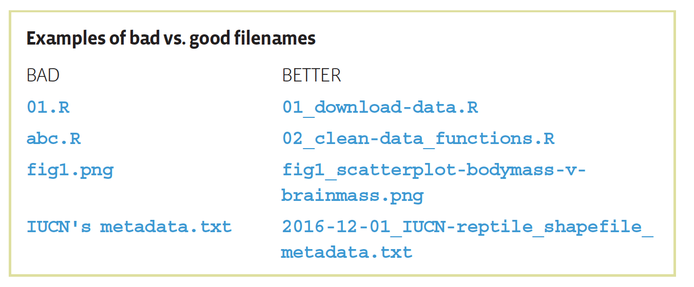

```{r setup, include=FALSE}
options(htmltools.dir.version = FALSE)
library(ggplot2)
```


#Welcome

--

Are you familiar with problems setting the working directory?

Did you ever had to re-run your code to produce results or graphs?

Do you ever have to work with both data, a script and a report?

Did you ever opened your own work and got lost in your own files?

Do you want to make your code, research or product useful for others? Or for future self?

--

# Ok, good you are here!

---
class: inverse, center, middle

# Aim: 
##learn how to maximize effectiveness, reduce frustration, facilitate collaboration and increase readability of your work


---
#DARTH workgroup, thank you! 
### This workshop is based on a paper written by the [DARTH](http://darthworkgroup.com) workgroup 
‘A coding framework for improving transparency in decision modeling’ - (under revision)

.center[]

`r icon:: fa("twitter", colour = "#011A5E")` <a href="http://twitter.com/darthworkgroup"> </i>&nbsp; @DARTHworkgroup</a><br>

---
# The workshop structure

- Introduction 

- How most people currently work

- How you can do better

- Get some hands-on experience

- Closing

---
class: inverse, center, middle

# Introduction 


---


class: inverse, center, middle

# How most<sup>*</sup> people currently work
(<sup>*</sup>includes me)

---

# Specialized software
Most of us use **many different software programs** and do not have a **clear**, **concise** and **consistent** file storage structure.

--

For example, I used:
- **MS Word** for manuscripts
- **MS Excel** for data collection
- **MS PowerPoint** for presentations and figures
- **Adobe Illustrator**, **Adobe InDesign** and **MS PowerPoint** for figures and posters
- **R** for data analysis
- **SPSS** or **STATA** for data analysis with others
- **TreeAge** for decision models
- ...

--

and I saved it without a clear naming convention or folder structure.

--

# Result?

---

background-image: url("./figs/slides/File structure Eline dates.png")
background-size: contain
background-position: 100% 30%
class: left, upper, inverse

# Uhm??
## Right!
---

background-image: url("./figs/slides/Dropbox_404error.png")
background-size: 500px
background-position: 50% 70%
class: center, upper

# Consequence

.footnote[
Image from [Dropbox](https://www.dropboxforum.com/t5/Sharing-and-collaboration/Video-won-t-play-when-shared/td-p/247437/page/3)
]

---

class: inverse, center, middle

# Does this sound familiar?

---

# Streamline your work using R

## You can use R for
- Data synthesis
- Data analysis
- Reporting
- Presenting

--

R has the potential to facilitate **transparency**, **reproducibility**, and **shareability**

But this all comes with a **very steep learning curve** which can cause a lot of frustration.

--

###Let's see how we can maximize effectiveness, reduce frustration, facilitate collaboration and increase readability of your work.


---

class: inverse, center, middle

# How you can do better 

*"If you spend too much time thinking about a thing, you'll never get it done"* - Bruce Lee

**But in this case spending a little time upfront can save a lot of time later on**

---
# Apply a structure

#### Cooper N, Hsing P-Y, editors. A Guide to Reproducible Code in Ecology and Evolution. London, UK: British Ecology Society; 2017.
*"The way we do science is changing — `data are getting bigger`, analyses are getting more complex, and governments, funding agencies and the scientific method itself `demand more transparency` and `accountability in research`. One way to deal with these changes is to `make our research more reproducible`, `especially our code`. Although most of us now write code to perform our analyses, it is often not very reproducible. We have all come back to a piece of work we have not looked at for a while and had `no idea what our code was doing or which of the many "final_analysis" scripts truly was the final analysis!` Unfortunately, the number of tools for reproducibility and all the jargon can leave new users feeling overwhelmed, with no idea how to start making their code more reproducible. So, we have put together `this guide` to help."* 

.footnote[More about file organization: Data Management:File Organization - Christine Malinowski - MITLibraries - January 21, 2016. [link](https://libraries.mit.edu/data-management/files/2014/05/FileOrg_20160121.pdf)]

---

# File system

*"There is no single best way to organise a file system. The key is to make sure that the structure of directories and location of files are consistent, informative and works for you."* [1]

.footnote[
[1] Cooper N, Hsing P-Y, editors. A Guide to Reproducible Code in Ecology and Evolution. London, UK: British Ecology Society; 2017.]
--

Different fields, but our projects have similar elements: 
- collecting data
- data cleaning
- analysis 
- reporting results

---
# Good project directory structure example:
- `data`        - all input data (and metadata) used in the analysis 
- `functions`   - for functions to help us modify the data
- `R`           - where interactive files for the analysis are stored 
- `figs`        - for the figures
- `tables`      - for the tables
- `output`      - any type of intermediate or output files
- *you might prefer an extra `cleaned-data` folder*
- `report`      - for the RMarkdown manuscript or report of results

---
background-image: url("./figs/slides/Final.doc-PhD.gif")
background-size: contain
background-position: 50% 50%
class: left, upper, inverse

---

# File naming conventions
.center[]

.footnote[Figure copied from Cooper N, Hsing P-Y, editors. A Guide to Reproducible Code in Ecology and Evolution. London, UK: British Ecology Society; 2017.]

---

class: inverse, center, middle

# Get some hands-on experience
"The secret of getting ahead is getting started" - Mark Twain
---

# Preparation
You are recommended to use the [RStudio IDE](https://www.rstudio.com/products/rstudio/), but you do not have to.

You can download the files for this workshop on the [Rladies Rotterdam Meetup page](https://www.meetup.com/nl-NL/rladies-rotterdam/events/261613889/)

---
background-image: url("./figs/slides/business-man-presenting-graph.png")
background-size: contain
background-position: 100% 80%
class: left, upper, inverse

# Case - Sales report 

---
# Case - Sales report 
### We are asked to report the sales of some widgets for different countries weekly

.footnote[
Example used from [satRdays Paris](https://github.com/satRdays/paris2019?files=1)
]

.pull-left[
### We need to deliver:
- A report including a summary table, some country specific graphs and an interpretation of some numbers. 
]

.pull-right[
### We get:
- .csv files containing the sales data
]

--

## How to approach this?

---
# Suggested approach 

- Start with a R-project 

- Create a folder structure

- Save the data files in the data folder 

- Load the data into your R environment 

- Draft code for the data analysis 

- Create a Markdown to finalize the analysis and to build the report

---
# R projects
Embrace a one folder = one project mentality. Rstudio's `R projects` are excellent for encouraging this. This habit enables easy communication with others. 

Solves your struggles with setting the working directory. 


`File -> New Project -> New Directory -> New project -> Directory name and location -> Create Project` 

.footnote[More about R projects [R studio link](https://support.rstudio.com/hc/en-us/articles/200526207-Using-Projects) and [R for Data Science - Garrett Grolemund and Hadley Wickham](https://r4ds.had.co.nz/workflow-projects.html)]

--
## Please create your own project


---

# Folder structure 

.pull-left[
Folders we need for sure:
- `data`        for the .csv files 
- `output`      for the modified data or combined data
- `figs`        for the figures
- `R`           where interactive files for the analysis are stored 
- `report`      for the manuscript
]

.pull-right[
*Maybe we also need*:
- `functions`   for functions to help us modify the data
- `tables`      for the tables
]

--

#### Our case example is much simpler than most other projects and is highly stylistic. Therefore, we don't need all folders, to organize it clear and concise. However, since our aim is to get a structure that is useful for detailed projects we will apply it to this simple example.

--
## Let's make the folders

---
# Organize files

We got three data files and two R scripts:
- (1) sales_summary.csv, (2) france.csv and (3) sales.csv
- `app0_packages-setup.R` and `app0_library-setup.R`

Save these files in the right folder.

### Create a new R script
- `Files -> New File -> R Scrip`
- give it an appropriate name 
- save it in the right folder

---
# Organize files (2)

### Embed the packages setup - only once 

```{r, eval = TRUE, echo = TRUE, warning = FALSE, message = FALSE}
source("R/app0_packages-setup.R") # install required packages
```

### Load the packages into the library 
```{r, eval = TRUE, echo = TRUE, warning = FALSE, message = FALSE}
source("R/app0_library-setup.R") # activated the needed libraries
```

---
# Data 
.footnote[
Example used from [satRdays Paris](https://github.com/satRdays/paris2019?files=1)
]
### Load the data into R
```{r}
# Load the data from the csv files and store in the R environment
sales_summary   <- read.csv("data/sales_summary.csv") 
sales_france    <- read.csv("data/france.csv")
sales_countries <- read.csv("data/sales_countries.csv")
``` 

--

### Explore data
```{r, echo = TRUE, eval = FALSE}
# Get a describtion of our data frames
summary(sales_summary)   # total sales for 10 widgets
summary(sales_france)    # daily widget sales (A-D) for France
summary(sales_countries) # daily widget sales (A-D) for South Africa, UK and US
```

---

#Data (2) - Combine

```{r, eval = TRUE, echo = TRUE}
sales <- rbind(sales_countries, sales_france) # combine two dataframes
summary(sales) # provide a summary
```

---

#Data (3) - Combine
```{r, eval = TRUE, echo = TRUE}
str(sales) # inspect the structure of the data
# Mutate the date into a date format
sales <- sales %>%
  mutate(date = as.Date(date))

save(sales, file = "output/sales.RData") # export combined data
```

---

## Sales summary Table

Below is a table with the total number of units sold per product.

```{r tables-sales_summary, eval = TRUE, echo = FALSE, warning = FALSE, message = FALSE}
knitr::kable(sales_summary, format = 'html', caption = 'Total units sold per product')
```

---
This the code you need to get this table
```{r, eval = FALSE, echo = TRUE, warning = FALSE, message = FALSE}
knitr::kable(sales_summary, format = 'html', 
             caption = 'Total units sold per product')
```


---
## Sales summary Chart

Here is a chart with the same data.
```{r echo=TRUE, eval = TRUE, warning = FALSE, fig.height = 4, message = FALSE}
# Plot a bar chart of total sales per product.
ggplot(sales_summary, aes(x = widget, y = count / 1000000)) +
  geom_col(fill = "#3498db") +
  labs(x = "product", y = "units sold / million") +
  ggtitle("Total units sold")

ggsave("figs/Fig1_sales-Chart.png") # save the figure
```

---
# Report weekly sales

```{r}
# modify the data 
sales_weekly <- sales %>%
  mutate(
    week_number = isoweek(date),
    dow = wday(date)
    ) %>%
  group_by(week_number, widget, country_name, country_code) %>%
  summarise(
    date = min(date),
    count = sum(count)
  )

head(sales_weekly)

save(sales_weekly, file = "output/sales_weekly.RData") # store the new data

```

---
# Best week per country
```{r, eval = TRUE, echo = TRUE, warning = FALSE, message = FALSE}
# Modify the data to select the best week per country
sales_weekly_best <- sales_weekly %>%
  group_by(country_name, week_number) %>%
  summarise(count = sum(count)) %>%
  arrange(desc(count)) %>%
  slice(1)

# Create a table
knitr::kable(sales_weekly_best, format = 'html', caption = 'Best week for each county')
```


---
# Write a function 
## to plot weekly sales per country

```{r}
# Write a function 
PlotWeeklySalesPerCountry <- function(country_value) {
  sales_weekly %>% 
  filter(country_code == country_value) %>% 

# plot 
ggplot(aes(x = date, y = count / 1000)) +
  geom_line(aes(colour = widget)) +
  scale_x_date(date_breaks = "1 month", date_labels = "%b") +
  scale_y_log10() +
  labs(x = "", y = "Units / thousand") +
  ggtitle(("Weekly Sales for:"), paste(country_value))
  }
```

Save this as an `.R` script in the functions folder. 

---
# Create weekly sales graph
```{r, eval = TRUE, echo = TRUE, warning = FALSE, message = FALSE}
country_value <- "USA"
PlotWeeklySalesPerCountry(country_value = "USA")  
```


### Try for other countries

---
# Markdown 
### We need to report these graphs more often. Therefore, we will create a report that we can automatically updated.

- To create a new R Markdown document from the menu go to `File -> New File -> R Markdown -> Document ->` Give it a title and author name `-> ok`. 

- Please note, your file is not save in a folder yet. Save your `.Rmd` file in the right folder

--
- We can modify the template to have a report we like;

- Click the `Knit` button to compile it. 


---
# R Markdown - set up

The R Markdown template starts with a general set up

```yaml
---
title: "My Markdown file"
author: "Eline Krijkamp"
date: "1-6-2019"
output: html_document 
---
```

--
### Add data to the report 
```{r, eval = FALSE}
This is the sales report generated at `r strftime(Sys.time(), "%H:%M %Z %d %B %Y")`. 
```
This is the sales report generated at `r strftime(Sys.time(), "%H:%M %Z %d %B %Y")`.


.footnote[See the help page `?markdown` to learn more.]


---
#Markdown (2)

Add sections for the plots and figures as a report. 

You only want the client to see the output, not the code. Therefore, we don't want to have all the code in the Markdown but integrate the different files. 

- `app0_library-setup.R`
- `data-cleaning.R`
- `graph-functions.R`


---
# Closing

### "The process, not the final achievement is what it's all about" - **Dean Koonts**

So let's make this process `HappieR`, by:

- Using R projects [1]
- Think about the structure of your work
- Apply the recommendations in small steps 
- Even with small steps we move to a more transparent world
- *"Partially reproducible research is much better than completely non-reproducible research."* [2]


.footnote[
[1] [R for Data Science - Garrett Grolemund and Hadley Wickham](https://r4ds.had.co.nz/workflow-projects.html)

[2] Cooper N, Hsing P-Y, editors. A Guide to Reproducible Code in Ecology and Evolution. London, UK: British Ecology Society; 2017.
]


---
class: center, middle

# A big thanks to
[**R-Ladies Rotterdam**](https://www.meetup.com/rladies-rotterdam/), 
[**42 workspace**](https://www.42workspace.com) & 
[**DARTH workgroup**](http://darthworkgroup.com)
[**satRdays Paris 2019**](https://github.com/satRdays/paris2019?files=1)

And especially **Paloma** for all her tips, tricks and help with this workshop.

Slides created via the R package [**xaringan**](https://github.com/yihui/xaringan).

*(Ps: This was my first time and I love it!)*

---
name: title
class: center, middle
#Thank you!!!#


### Keep in touch!
`r icon:: fa("paper-plane", colour ="#011A5E")`</i>&nbsp;e.krijkamp@erasmusmc.nl</a><br>

`r icon:: fa("twitter", colour = "#011A5E")` <a href="http://twitter.com/ekrijkamp"> </i>&nbsp; @ekrijkamp</a><br>

`r icon:: fa("github", colour = "#011A5E")` <a href="http://github.com/krijkamp"> </i>&nbsp; @krijkamp</a><br>


